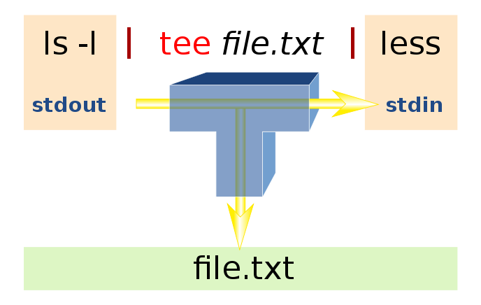

theme: Zurich, 5

## Unixcorn


---

# Plan

* command
* combine
* conquer

---

# Command: cat, tail & head

```bash
# output contents of file to STDOUT
cat file

# print the last 10 lines to STDOUT
tail file

# print last 20 lines and keep following
tail -n 20 -f file
```

---

# Combine

```bash
# The pipe character connects left STDIN with right STDOUT
head -n 100 file | tail -n 10

# FIFO (named pipes)
mkfifo my_pipe
gzip -9 -c < my_pipe > out.gz &
cat file > my_pipe
rm my_pipe
```

---

# Combine

```bash
# output to file
cat file > other_file

# Dump database, zip and save to dated file
pg_dumpall | gzip -c > database_$(date +%Y-%m-%d).sql.gz
```

---

# Bonus: bcat [^1]

```bash
# Pipe STDOUT to your browser
# eg: read man page
gem install bcat
man tail | bcat

# in .bashrc or .zshrc
export MANPAGER='col -b |bcat'
```

[^1]: Browser cat, see http://rtomayko.github.io/bcat/

---

# Command: sort & uniq

```bash
# Sort lines of a file, numerically
sort -nr file

# Only show duplicate lines once (input must be sorted)
uniq

# Count duplicate lines
uniq -c
```

---

# Command: curl

```bash
# Transfer from URL.
# Use 'copy as curl' from Chrome. Cookies!
curl 'http://localhost:3000/assets/application-...js'
-H 'Cookie: _session_id=d42df..; XSRF-TOKEN=7Kj5K..;' > app.js
```

---

# Command: netcat [^1]

```bash
# Server serves a file
cat backup.iso |  nc -l 3333

# Client downloads the file
# Show progress with pv
nc 192.168.0.1 3333 | pv -b > backup.iso

# Create partition image, send to a remote machine
dd if=/dev/hdb5 | gzip -9 | nc -l 3333
```

[^1]: https://www.g-loaded.eu/2006/11/06/netcat-a-couple-of-useful-examples/

---

# Command: ssh

```bash
# SSH tunnel (poor man's ngrok, expose localhost externally)
ssh -f server.com -L 3000:server.com:3000 -N

# Or access production data with Postgres GUI tools
# locally on port 63333
ssh -L 63333:localhost:5432 joe@foo.com
```

---

# Command: wc, ls

```bash
# Count lines
cat file | wc -l

# Count chars
cat file | wc -m

# Count words
cat file | wc -w

# Files sorted by time modified, recent last
ls -ltr
```

---

# Command: netstat

```bash
# On linux (not BSD/OS X),
# show programs listening to tcp
sudo netstat -tpl

Active Internet connections (only servers)
Proto Recv-Q Send-Q Local Address        Foreign Address    State       PID/Program name
tcp        0      0 localhost:5562       *:*                LISTEN      29038/ppx
tcp        0      0 *:6379               *:*                LISTEN      3554/redis-server *
tcp        0      0 *:ssh                *:*                LISTEN      21352/sshd
tcp        0      0 *:postgresql         *:*                LISTEN      23240/postgres
tcp6       0      0 [::]:6379            [::]:*             LISTEN      3554/redis-server *
tcp6       0      0 [::]:ssh             [::]:*             LISTEN      21352/sshd
tcp6       0      0 [::]:postgresql      [::]:*             LISTEN      23240/postgres
```

---

# Command: ps, top, iotop

```bash
# List running commands of all users
ps aux

# Activity monitor for linux
top

# Show disk IO usage per program
sudo iotop
```

---

## Command: tee, sudo

```bash
# tee is like ruby's tap
# ssh with normal sudo user, and write STDIN to a file as root
cat ~/.ssh/id_rsa.pub | ssh user@server "sudo tee -a /root/.ssh/authorized_keys"
```



---

## OS X: pbcopy, pbpaste

---

## Tool: sed

```bash
# like ruby's gsub but for streams
```

---

## Tool: awk

```bash
# short for awkward ;)
```

---

## Tool: grep

---

## Conquer

> Copy the contents of a remote file to clipboard

```bash
ssh server.com "cat /remote/file" | pbcopy
```

---

## Conquer

> Tail a server log in your browser

```bash
ssh server.com "tail -f $RAILS_ROOT/log/production.log" |bcat
```

---

## Conquer

> Find the longest lines in a text file

```bash
cat app.js | awk '{print length, $0}' | sort -nr | head -100 | less
```

---

## Conquer

> Transfer postgresql database in one awesome pipe

```bash
# From the receiving end
ssh server.com "pg_dumpall | gzip -6" | gunzip -c | psql
```

---

## Conquer

> Find the most used commands from your shell history

---

## Conquer

> Find the most used commands from your shell history

```bash
history | awk '{print $2}' | sort | uniq -c | sort -nr | head
```

---

# More

* https://www.tjhsst.edu/~dhyatt/superap/unixcmd.html
* https://www.tutorialspoint.com/unix/unix-useful-commands.htm
* https://www.quora.com/What-is-the-best-list-of-Unix-commands-that-I-can-stick-on-the-walls-of-my-cubicle
